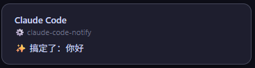

# Claude Code Notify

[]()
[]()
[]()
[]()

> 离开 Claude Code 去做其他事，任务完成时自动弹窗通知你，不用一直盯着终端。

## Feature

- 🔔 **桌面通知** — 任务完成或需要你回应时，系统原生弹窗，不打断操作
- 📝 **三行层级** — 项目名 + 💎 会话名 + 任务内容，一目了然
- 🗣️ **语音开关** — 直接说"关掉通知"/"打开通知"，AI 帮你搞定
- ⚡️ **零依赖** — 无需安装任何第三方包，调用 Windows/macOS 原生通知 API
- 🪄 **一次配置永久生效** — skill 一键安装，一条命令完成配置，以后自动通知
- 🖥️ **跨平台** — Windows 10/11 Toast 通知 & macOS 通知中心
- 🎨 **优雅弹窗** — 自定义 WinForms UI，5 种主题，支持二次元立绘、按钮
- 🎛️ **定制配置** — 可视化网页配置，自由调整主题/图标/上传立绘
- 🔄 **模式切换** — 一句话在系统弹窗和优雅弹窗间切换

## 安装

```bash
npx skills add qyzxcswbll/claude-code-notify -g
```

安装后在 Claude Code 中执行以下任一方式完成配置：

- **CLI 版**（终端）：输入 `/notify-setup`
- **VSCode 版**（聊天框）：直接说 **「配置桌面通知」**，AI 会自动执行

按提示确认权限即可。

## 弹窗模式

支持两种模式自由切换：

- **系统弹窗 (V1)** — 原生 Toast 通知，轻量简洁
- **优雅弹窗 (V2)** — 自定义 WinForms 窗口，支持主题/立绘/按钮

说 **「切换优雅弹窗」** 或 **「切回系统通知」** 即时切换，无需重启。

## 定制配置

通过可视化网页配置弹窗外观：

1. 在 Claude Code 中说 **「定制弹窗」**
2. AI 自动启动配置服务和配置页面
3. 选择模式：🔔 系统弹窗 / ✨ 优雅弹窗
4. 选择主题、自定义图标、上传立绘
5. 调整弹窗高度、圆角、停留时长
6. 点击「保存」立即生效




## 开关通知

临时不需要通知时，直接对 Claude Code 说 **「关掉通知」** 即可。想恢复时说 **「打开通知」**。

也可以用脚本操作：

- **Windows**：双击 `%USERPROFILE%\.claude\notify-toggle.bat`，或 Win+R 运行：
  ```
  %USERPROFILE%\.claude\notify-toggle.bat
  ```

- **macOS**：双击 `~/.claude/notify-toggle.sh`，或终端运行：
  ```bash
  bash ~/.claude/notify-toggle.sh
  ```


## 功能对比

| 特性 | 系统弹窗 (V1) | 优雅弹窗 (V2) |
|------|:----------:|:----------:|
| 通知方式 | Windows Toast / macOS 通知中心 | WinForms 自绘窗口 |
| 视觉风格 | 系统原生 | 自定义主题（5 种） |
| 项目名 + 会话名 | ✅ | ✅ 层级更清晰 |
| 二次元立绘 | ❌ | ✅ 支持 PNG 上传 |
| 自定义图标 | ✅ emoji | ✅ emoji |
| 渐入/淡出动画 | ❌ | ✅ |
| 右下角固定按钮 | ❌ | ✅ |
| 可调高度 | ❌ | ✅ 180-350px |
| 自动消失 | ✅ 系统默认 | ✅ 可设时长 |
| 开关控制 | ✅ | ✅ |

## FAQ

- **为什么用 skill 而不是直接安装？**

  skill 只需要一次 `/notify-setup` 调用，AI 自动完成脚本创建和配置注入。不需要你手动新建文件、复制粘贴代码、编辑 JSON。

- **如何更新到最新版本？**

  重新安装并重新配置：
  ```bash
  npx skills add qyzxcswbll/claude-code-notify -g --yes
  ```
  然后在 Claude Code 中说「配置桌面通知」重新生成脚本。

- **安装后通知没有弹出来？**

  先手动测试：Windows 执行 `powershell -ExecutionPolicy Bypass -File "$env:USERPROFILE\.claude\notify.ps1" -Event stop`，macOS 执行 `echo '{}' | bash ~/.claude/notify stop`。有报错说明文件写入或编码有问题，检查 `~/.claude/notify` 文件内容是否完整、编码是否为 UTF-8 BOM（Windows）。

- **会影响 Claude Code 的响应速度吗？**

  不会。hooks 以子进程运行，`timeout: 10` 秒封顶。通知脚本只读 JSONL 文件末尾 100 行，通常几毫秒完成，即使失败也不影响主流程。

- **支持 Linux 吗？**

  目前不支持。Linux 桌面通知方案各有差异（notify-send、D-Bus），后续视需求添加。

---

## 许可证

MIT
